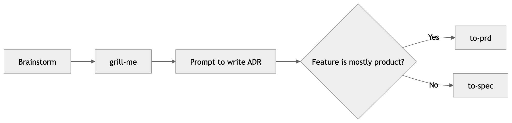

# chrisetheridge/skills

Personal skills for Pi.

## Install

Install this package from a local checkout:

```bash
pi install ./path/to/skills
```

Install it from git:

```bash
pi install git:github.com/chrisetheridge/skills
```

## Skills

### Agent Doctor

Audits a repository's agent-readiness. Use it to improve agent docs, domain context, setup guidance, issue tracker notes, and skill installation guidance.

### Code Simplify

Refactors working code for clarity without changing behavior. Use it when code has become harder to read, maintain, or extend.

### New Task

Creates a lightweight task contract for new agent work. Use it to make scope, non-goals, acceptance criteria, implementation notes, verification, and remaining risks explicit.

### Refactor Code

Refactors existing code without changing observable behavior. Use it to improve structure, reduce technical debt, split large functions, reduce duplication, or prepare code for a feature while preserving behavior.

### Setup TypeScript Pre-Commit

Sets up a standard TypeScript pre-commit workflow with:

- Biome for linting and formatting
- Husky for commit hooks
- lint-staged for staged-file checks
- type checking and tests when the repo already has scripts for them

### To Spec

Turns ADRs, technical decisions, architecture discussions, or brownfield refactor context into an engineering-focused spec.

Use it for internal architecture migrations, API contracts, state ownership, provider boundaries, platform refactors, or technical work without product user stories.

## Workflow


